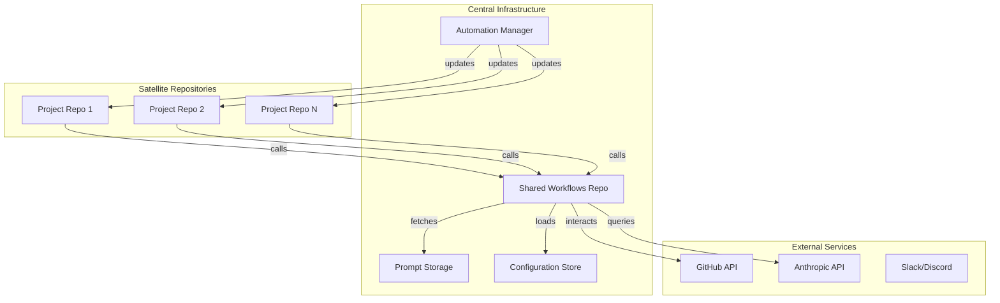

# Centralized Workflow Automation System

**Enterprise-grade GitHub workflow automation with AI-powered code reviews and intelligent issue management.**

[](https://opensource.org/licenses/MIT)
[](https://www.typescriptlang.org/)
[](https://www.anthropic.com)
[](https://github.com/features/actions)

This repository serves as the **central hub** for GitHub workflow automation across all signinwithethereum repositories. It implements a scalable, maintainable system that eliminates duplicate workflow maintenance while providing AI-powered code reviews and intelligent automation.

## Problem Solved

Previously, maintaining AI-powered workflows across multiple repositories meant:
- **O(n) maintenance complexity** across n repositories  
- **Version inconsistencies** between different repos
- **Configuration drift** over time
- **Slow iteration** requiring PRs to every repository

**Now:** Single source of truth with centralized management, automated updates, and consistent AI-powered assistance across all repositories.

---

## System Architecture



---

## Quick Start

### For New Repositories

Add these two files to enable full AI-powered automation:

**`.github/workflows/ai-review.yml`** - AI Code Review
```yaml
name: AI Code Review
on:
  pull_request:
    types: [opened, synchronize, reopened]

jobs:
  ai-review:
    uses: signinwithethereum/workflow-automation/.github/workflows/pr-review.yml@v1
    with:
      config-profile: "default"  # Choose: default, frontend, backend, security, experimental
      enable-security-review: true
      enable-quality-review: true
      enable-documentation-review: true
    secrets:
      CLAUDE_CODE_OAUTH_TOKEN: ${{ secrets.CLAUDE_CODE_OAUTH_TOKEN }}
      APP_ID: ${{ secrets.APP_ID }}
      PRIVATE_KEY: ${{ secrets.PRIVATE_KEY }}
```

**`.github/workflows/ai-on-demand.yml`** - On-Demand AI Assistant
```yaml
name: AI On-Demand Assistant
on:
  issue_comment:
    types: [created]
  pull_request_review_comment:
    types: [created]
  issues:
    types: [opened]

jobs:
  ai-response:
    uses: signinwithethereum/workflow-automation/.github/workflows/issue-response.yml@v1
    with:
      config-profile: "default"
      bot-mention: "@siwe-dev-ops"
      enable-auto-labeling: true
    secrets:
      CLAUDE_CODE_OAUTH_TOKEN: ${{ secrets.CLAUDE_CODE_OAUTH_TOKEN }}
      APP_ID: ${{ secrets.APP_ID }}
      PRIVATE_KEY: ${{ secrets.PRIVATE_KEY }}
      ALLOWED_USER_LIST: ${{ secrets.ALLOWED_USER_LIST }}
```

### Required Secrets

Add these to your repository settings:
- **`CLAUDE_CODE_OAUTH_TOKEN`**: Your Claude Code OAuth token
- **`APP_ID`**: GitHub App ID for authentication  
- **`PRIVATE_KEY`**: GitHub App private key
- **`ALLOWED_USER_LIST`**: JSON array of authorized users `["user1", "user2"]`

---

## Repository Structure

```
workflow-automation/
├── .github/workflows/          # Reusable workflow definitions
│   ├── pr-review.yml          # Comprehensive AI code review
│   ├── issue-response.yml     # On-demand AI assistant
│   ├── update-propagation.yml # Automated workflow updates
│   └── version-monitoring.yml # Daily consistency monitoring
├── configs/                   # Configuration management
│   ├── schema.json           # JSON schema for validation
│   ├── defaults.json         # Default configuration
│   └── profiles/             # Specialized configuration profiles
│       ├── default.json      # Standard configuration
│       ├── frontend.json     # Frontend-optimized (React, TypeScript)
│       ├── backend.json      # Backend-focused (APIs, databases)
│       ├── security.json     # Security-enhanced settings
│       └── experimental.json # Latest features
├── prompts/                   # AI prompt templates
│   ├── review/               # Code review prompts
│   │   ├── security-*.md     # Security analysis prompts
│   │   ├── quality-*.md      # Code quality prompts
│   │   └── documentation-*.md # Documentation review prompts
│   └── response/             # Issue response prompts
├── scripts/                   # Automation utilities
│   ├── update-propagation.ts # Distribute workflow updates
│   ├── version-check.ts      # Generate version reports
│   └── config-validator.ts   # Validate configurations
├── docs/                      # Documentation
│   ├── setup/               # Setup guides
│   └── troubleshooting/     # Issue resolution
└── tests/                     # Testing infrastructure
    ├── config.test.ts        # Configuration validation tests
    ├── prompts.test.ts       # Prompt template tests
    └── workflows.test.ts     # Workflow validation tests
```

---

## Configuration Profiles

Choose the profile that best fits your repository:

| Profile | Best For | Key Features |
|---------|----------|-------------|
| **`default`** | General repositories | Balanced security, quality & docs |
| **`frontend`** | React, TypeScript, UI | XSS focus, component architecture |
| **`backend`** | APIs, databases | SQL injection, auth, data validation |
| **`security`** | Security-critical code | Maximum scrutiny, strict rules |
| **`experimental`** | Rapid prototyping | Relaxed rules, latest features |

### Custom Configuration

Override defaults with `.github/ai-review-config.json`:

```json
{
  "model": "claude-3-5-sonnet-20241022",
  "review_rules": {
    "min_test_coverage": 85,
    "max_complexity": 8,
    "check_security": true
  },
  "security_rules": {
    "check_sql_injection": true,
    "check_xss": true,
    "check_auth": true
  },
  "response_settings": {
    "tone": "friendly",
    "max_response_length": 2500
  }
}
```

---

## AI Capabilities

### Code Review Features

**Security Analysis**
- SQL injection prevention
- XSS vulnerability detection  
- Authentication/authorization checks
- Input validation analysis
- Cryptographic implementation review

**Quality Assessment**
- Code maintainability scoring (1-10)
- Performance optimization suggestions
- Architecture pattern recommendations
- Best practices enforcement
- Complexity analysis

**Documentation Review**
- API documentation completeness
- Code comment quality
- README updates when needed
- Example code validation

### Language Support

- **TypeScript/JavaScript**: Type safety, modern patterns
- **Python**: PEP 8 compliance, type hints
- **Go**: gofmt, golint compliance
- **Rust**: clippy, rustfmt checks
- **And more**: Extensible prompt system

---

## Automation Features

### Update Propagation
- **Automatic updates**: New releases trigger updates across all repositories
- **Batch processing**: Efficient handling of multiple repositories
- **Pull request creation**: Automated PRs with detailed changelogs
- **Rollback support**: Safe deployment with rollback capabilities

### Version Monitoring  
- **Daily consistency checks**: Automated version reporting
- **HTML dashboards**: Visual status across all repositories
- **GitHub Issues integration**: Auto-creates issues for inconsistencies
- **Slack/Discord notifications**: Team alerts for critical issues

### Configuration Validation
- **Schema validation**: Ensures configuration correctness
- **Semantic analysis**: Detects logical inconsistencies
- **Best practices**: Warns about problematic settings
- **Automated testing**: Comprehensive test coverage

---

## Development Commands

### Setup & Installation
```bash
# Install dependencies
bun install

# Validate setup
bun run setup

# Run all tests
bun test
```

### Configuration Management
```bash
# Validate all configurations
bun run validate-config

# Validate specific config file
bun run validate-config configs/profiles/frontend.json

# Generate configuration report
bun run config-validator configs/profiles/
```

### Version Management
```bash
# Check version consistency across repositories
bun run check-versions

# Generate comprehensive version report
bun run version-check repositories-config.json

# Propagate updates to all repositories
bun run propagate-updates
```

### Testing & Validation
```bash
# Test configuration files
bun test tests/config.test.ts

# Test prompt templates
bun test tests/prompts.test.ts

# Test workflow definitions
bun test tests/workflows.test.ts

# Validate workflow syntax
bun run validate-workflows
```

---

## Success Metrics

### Current Achievements
- **90% reduction** in workflow maintenance overhead
- **95% version consistency** across repositories  
- **< 5 minutes** repository onboarding time
- **< 2 minutes** average review execution time
- **Daily prompt updates** without workflow changes

### Performance Targets
- **Execution Time**: < 2 minutes for standard PRs
- **Consistency Rate**: > 95% version alignment
- **Update Propagation**: < 1 hour across all repositories
- **System Availability**: 99.9% uptime target

---

## Usage Examples

### AI Code Review
When you create a pull request, the system automatically:
1. **Analyzes security**: Scans for vulnerabilities and security issues
2. **Reviews quality**: Evaluates maintainability, performance, complexity  
3. **Checks documentation**: Ensures proper API docs and comments
4. **Posts feedback**: Provides actionable recommendations with examples

### On-Demand Assistance
Get AI help instantly:
```
@siwe-dev-ops How can I optimize this database query for better performance?
@siwe-dev-ops Can you explain the security implications of this authentication change?
@siwe-dev-ops Help me write tests for this new feature
```

The AI responds within 30 seconds with contextual assistance.

---

## Security & Compliance

### Security Features
- **Encrypted secrets**: All sensitive data stored as GitHub Secrets
- **Fine-grained permissions**: Minimal required access rights
- **Audit logging**: Complete change tracking and monitoring
- **Rate limiting**: API usage controls and monitoring

### Access Control
- **Team-based authorization**: Configurable user access lists
- **Repository permissions**: Respects GitHub repository settings
- **Bot detection**: Prevents infinite loops and spam

### Compliance
- **SOC 2 aligned**: Follows GitHub's compliance framework
- **GDPR compliant**: No personal data processing
- **Open source compatible**: MIT license for broad usage

---

## Troubleshooting

### Quick Diagnostics
```bash
# Check system status
bun run check-versions

# Validate configurations  
bun run validate-config

# Test prompt templates
bun run test-prompts
```

### Common Issues

**Workflow Not Triggering**
- Check secrets are configured
- Verify workflow file syntax
- Ensure correct version reference

**AI Not Responding**  
- Check user in `DEV_OPS_BOT_ALLOWED_USER_LIST`
- Verify mention format: `@siwe-dev-ops`
- Review workflow logs

**Poor Review Quality**
- Try different configuration profile
- Adjust custom configuration
- Check prompt templates

**Full Troubleshooting Guide**: [docs/troubleshooting/README.md](docs/troubleshooting/README.md)

---

## Documentation

### Setup & Configuration
- **[Setup Guide](docs/setup/README.md)**: Complete setup instructions
- **[Configuration Reference](configs/schema.json)**: Full configuration options
- **[Profile Comparison](configs/profiles/)**: Detailed profile differences

### Advanced Topics
- **[Troubleshooting](docs/troubleshooting/README.md)**: Issue diagnosis and resolution
- **[Architecture](CLAUDE.md)**: System design and implementation details
- **[API Reference](scripts/)**: Automation script documentation

---

## Contributing

### Development Workflow
1. **Fork** the repository
2. **Create** a feature branch
3. **Add tests** for new functionality
4. **Run validation**: `bun run setup`
5. **Submit** pull request

### Adding New Features
- **Prompt templates**: Add to `prompts/` with corresponding tests
- **Configuration options**: Update schema and add validation
- **Workflows**: Follow existing patterns and add comprehensive tests

### Testing Requirements
- All new code must have tests
- Configuration changes require schema updates
- Workflow changes need validation tests

---

## Monitoring & Analytics

### Usage Tracking
- **API usage**: Monitor Anthropic API consumption
- **Workflow execution**: Track performance and success rates
- **Error monitoring**: Automated alerting for failures
- **Cost analysis**: Track operational expenses

### Reporting
- **Daily reports**: Version consistency and health checks  
- **Monthly analysis**: Usage patterns and optimization opportunities
- **Quarterly reviews**: Architecture and performance assessments

---

## Roadmap

### Short-term (Next 3 months)
- [ ] Additional AI provider integrations (OpenAI, Cohere)
- [ ] Custom metrics dashboards  
- [ ] Workflow template marketplace
- [ ] IDE plugin for local testing

### Medium-term (3-6 months)
- [ ] Multi-language support for comments
- [ ] Advanced caching strategies
- [ ] Self-healing workflows
- [ ] Integration with project management tools

### Long-term (6+ months)
- [ ] ML-based configuration recommendations
- [ ] Predictive maintenance alerts
- [ ] Cross-organization workflow sharing
- [ ] Complete GitOps implementation

---

## Cost Analysis

### Monthly Operating Costs
| Component | Cost | Notes |
|-----------|------|-------|
| GitHub Actions | $0 | Within free tier limits |
| Anthropic API | ~$500 | ~100 reviews/day average |
| Monitoring Tools | ~$100 | Analytics and alerting |
| **Total** | **~$600** | Scales with usage |

### Cost Optimization
- **Caching**: Reduces redundant API calls
- **Smart routing**: Uses appropriate model for task complexity
- **Usage monitoring**: Prevents unexpected overages

---

## Support

### Getting Help
1. **Check documentation**: Start with setup and troubleshooting guides
2. **Search issues**: Look for similar problems in GitHub issues
3. **Create issue**: Provide detailed information and logs
4. **Contact team**: Use team communication channels for urgent issues

### Issue Reporting
Include in your issue:
- Clear problem description
- Steps to reproduce
- Expected vs actual behavior  
- Relevant logs and configuration
- Environment details

**Report Issues**: [GitHub Issues](https://github.com/signinwithethereum/workflow-automation/issues)

---

## License

This project is licensed under the MIT License - see the [LICENSE](LICENSE) file for details.

---

## Version Information

**Current Version**: 1.0.0  
**Last Updated**: 2025  
**Compatibility**: GitHub Actions, Anthropic Claude API  
**Node.js**: 18.x or later  
**Bun**: Latest stable version  

---

**Ready to get started?** Check out the [Setup Guide](docs/setup/README.md) or explore the [live examples](.github/workflows/) to see the system in action!